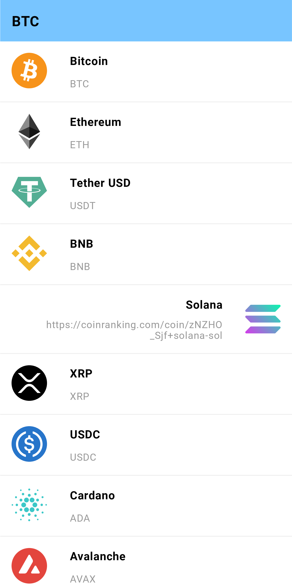
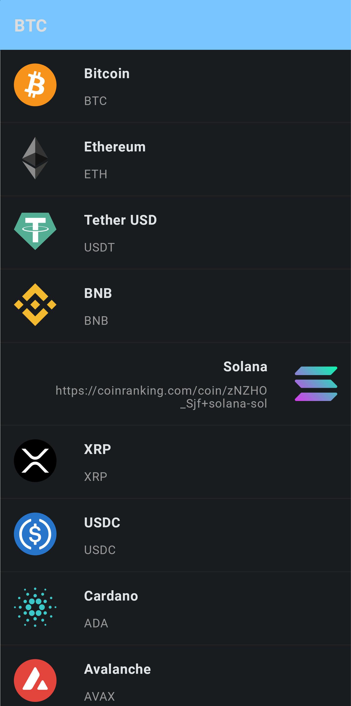

# CoinRankingApp

CoinRankingApp is an Android application that allows users to track the latest cryptocurrency prices and top performing cryptocurrencies.

## Features

- View a list of popular cryptocurrencies
- View detailed information about each cryptocurrency

## Installation

<!-- 1. Download apk from [release page]() -->

2. Install the apk on your Android device
3. Follow the on-screen instructions to install the app.

## Usage

1. Launch the CoinRankingApp on your Android device
2. View the list of popular cryptocurrencies
3. Click on a cryptocurrency to view detailed information

## Acknowledgements

- [CoinRanking API](https://coinranking.com/page/cryptocurrency-api) - A free API for cryptocurrency data
- [Glide](https://github.com/bumptech/glide) - A fast and efficient image loading library for Android
- [Retrofit](https://square.github.io/retrofit/) - A type-safe HTTP client for Android and Java
- [Hilt Dagger](https://dagger.dev/hilt/) - A dependency injection library for Android
- [Room](https://developer.android.com/jetpack/androidx/releases/room) - A persistence library for Android
- [Jetpack Compose](https://developer.android.com/jetpack/compose) - A modern toolkit for building native Android UI
- [Pagination](https://developer.android.com/topic/libraries/architecture/paging/v3-overview) - A library for paginating data in Android
